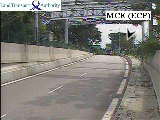

# LTAMALLTrafficCameraPictureExtraction
The objective of this project is to obtain real-time traffic images from LTAMALL so as to obtain the overhead pictures of Singapore vehicles and potentially to figure out the density of the traffic at any particular point.

